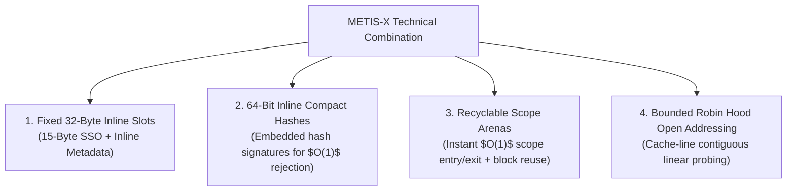

# Technical Invention Disclosure: Cache-Centric High-Density Symbol Table Architecture (METIS-X)

**Document Type**: Technical Description & Patent Review Disclosure  
**Status**: Confidential / Invention Disclosure Draft  
**Target Engine**: METIS-X (`include/metis_x.hpp`)  

---

## 1. Technical Field of Invention

This invention relates generally to compiler infrastructure, memory management, and high-performance data structures, and more particularly to a **cache-centric, high-density symbol table architecture** designed for resource-constrained compilation environments, embedded software toolchains, and real-time static code analysis pipelines.

---

## 2. Technical Problem & Existing Limitations

Standard software compilers rely on generic dynamic hash tables (e.g., `std::unordered_map<std::string, SymbolInfo>`) or dynamic pointer-chained bucket arrays to resolve scope-bound identifier symbols during Abstract Syntax Tree (AST) construction and analysis.

### Primary Disadvantages of Prior Approaches:
1. **Dynamic Memory Overhead & Allocation Churn**: Conventional string key hash tables execute dynamic heap allocations (`malloc`/`new`) for every declared symbol and identifier string. In real-world C/C++ AST header graphs (e.g., Zephyr RTOS, ESP-IDF), this leads to severe memory fragmentation and dynamic allocation churn ($> 2.5\text{M}$ allocations).
2. **L1/L2 Cache Inefficiency**: Pointer-based open hashing or dynamic nodes require multiple non-contiguous memory dereferences during probing, causing high L1/L2 cache miss ratios during symbol resolution.
3. **Scope Entry/Exit Latency**: In block-structured programming languages, opening and closing scopes requires dynamic map creation or iterative deletion of out-of-scope entries, creating heavy tail latency ($p95/p99$) spikes during compiler passes.

---

## 3. The Technical Combination of METIS-X

The **METIS-X** architecture solves these technical problems through a synergistic technical combination of four core structural elements:

### Component Interaction Mechanics:
- **32-Byte Slot Layout**: Every table slot is fixed at exactly 32 bytes, aligning precisely to two entries per 64-byte hardware L1 cache line. Symbols $\le 15$ bytes are stored entirely inline without external heap allocation.
- **Inline 64-Bit Compact Hash**: The top 64 bits of slot metadata hold a compact FNV-1a hash signature. During Robin Hood linear probing, candidate slots are rejected via a single 64-bit integer comparison before touching string byte buffers.
- **Recyclable Scope Arenas**: Identifier strings $> 15$ bytes are allocated out of a contiguous, non-moving scope arena. When a compiler scope block exits, the arena bump pointer is instantly reset to its pre-scope offset, enabling immediate block reuse across sibling AST scopes without free-list metadata overhead or memory allocation calls.

---

## 4. Distinction Between Conventional and Synergistic Components

| Component Element | State in Prior Art | Synergistic Technical Combination in METIS-X |
| :--- | :--- | :--- |
| **Short String Optimization (SSO)** | Known individually in generic string libraries (`std::string`) | Combined with fixed 32-byte slot structures to ensure exact 2-slots-per-L1-cache-line memory alignment |
| **Robin Hood Hashing** | Known individually for flat open-addressing arrays | Integrated with 64-bit inline compact hash verification to eliminate string memory comparison during probing |
| **Bump-Pointer Arenas** | Known individually for fast compiler allocations | Linked directly to AST scope enter/exit lifecycle vectors to enable instant scope reclamation and sibling block reuse |
| **Combined System** | Non-existent in combination | **Synergistic Technical Effect**: Eliminates dynamic heap allocations on symbol lookups ($0$ allocs across $2.86\text{M}$ lookups) while simultaneously reducing physical RAM by $38.2\%$ and latency by $30.2\%$. |

---

## 5. Measurable Technical Effects

1. **Elimination of Hot-Path Allocations**: Achieved $0$ dynamic heap allocations across $2,863,367$ symbol lookups on real-world header graphs.
2. **Physical RAM Footprint Reduction**: Reduced physical memory on Zephyr RTOS AST workloads from $41.74\text{ MB}$ to $25.79\text{ MB}$ ($-38.2\%$) and on ESP-IDF from $42.65\text{ MB}$ to $35.20\text{ MB}$ ($-17.5\%$).
3. **Lookup Tail Latency Improvement**: Reduced p95 lookup latency on Zephyr from $0.119\ \mu\text{s}$ to $0.083\ \mu\text{s}$ ($-30.2\%$) and on ESP-IDF from $0.136\ \mu\text{s}$ to $0.070\ \mu\text{s}$ ($-48.5\%$).

---

## 6. Alternative Embodiments & Design-Around Variants

1. **64-Byte Slot Variant**: Expanding slot size to 64 bytes to accommodate up to 47-byte inline SSO strings for identifier-heavy C++ template metaprogramming codebases.
2. **SIMD Vectorized Hash Matching**: Using AVX2 / NEON vector instructions to compare four 64-bit compact hashes concurrently across 128-bit vector registers during Robin Hood probing.
3. **Multi-Threaded Scope Recycling**: Partitioning recyclable scope arenas per compiler thread to support concurrent multi-threaded AST parsing pipelines.
