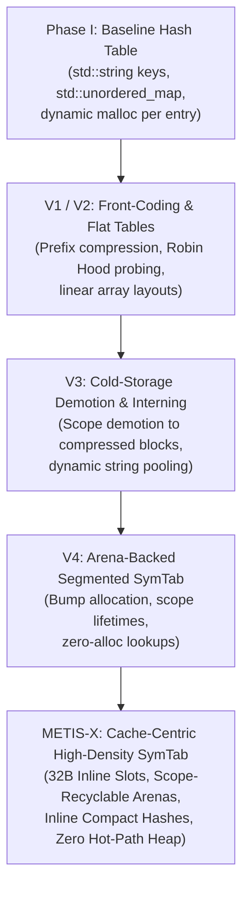

# Architectural Evolution of METIS & METIS-X

This document provides a comprehensive structural record of the design evolution, architectural transitions, empirical trade-offs, and evolutionary milestones of the **METIS** and **METIS-X** symbol table engines.

---

## 1. Timeline & Structural Evolution

---

## 2. Phase I: Baseline SymTab Architecture
* **Implementation**: `std::unordered_map<std::string, SymbolInfo>`
* **Memory Layout**: Individual dynamic heap allocations per symbol node plus 32--48 bytes of bucket pointer indirection per bucket.
* **Limitations**: High dynamic memory fragmentation, low L1 cache locality during probing due to pointer chasing, dynamic allocation overhead on every symbol insertion and scope transition. Unsuitable for memory-restricted embedded compiler tools (< 64 MB RAM limits).

---

## 3. V1 & V2: Front-Coding & Robin Hood Probing
* **Implementation**: Flat arrays using Robin Hood open-addressing hash tables paired with front-coding prefix string compression.
* **Empirical Findings**:
  - Open-addressing Robin Hood layout eliminated pointer-chasing and drastically improved L1 cache hit rates.
  - Incremental front-coding prefix compression incurred severe lookup latency penalties ($2.4\times$ lookup slowdown) due to sequential string decoding requirements, while yielding $< 4\%$ memory savings due to per-string slice header overheads.
* **Pivot**: Abandoned prefix front-coding in favor of fixed-size Inline Short String Optimization (SSO).

---

## 4. V3: Scope-Based Cold Storage Demotion & Global Interning
* **Implementation**: Active symbols maintained in a primary table; out-of-scope symbols demoted to compressed memory blocks. Global string interning deduplicated recurring identifier strings.
* **Empirical Findings**:
  - Scope demotion reclaimed active table slots.
  - Global dynamic string interning incurred $15\text{--}25\%$ execution latency penalties from hash table locks and string interning lookups on short-lived scope variables.
* **Pivot**: Replaced dynamic string interning with scope-bound bump-pointer arenas with instant reset on scope exit.

---

## 5. V4: Arena-Backed Segmented Symbol Table
* **Implementation**: Non-moving bump-pointer arenas for variable-length identifiers ($> 15$ bytes) combined with SSO for short identifiers ($\le 15$ bytes).
* **Empirical Findings**:
  - Scope creation and destruction accelerated to $O(1)$ bump-pointer saves/restores.
  - Eliminated heap allocations during AST traversal for short symbols.

---

## 6. METIS-X: Current Cache-Centric Architecture
* **Implementation**:
  1. **32-Byte Inline Slots**: Compact cache-line aligned slot structures containing inline 15-byte string SSO storage.
  2. **64-Bit Inline Hashes**: Embedded compact hash signatures within slot structures to shortcut string comparisons during probing.
  3. **Recyclable Scope Arenas**: Arena bump pointers bound to AST scope lifetimes with memory block reuse across sibling scopes.
  4. **Robin Hood Open Addressing**: Cache-friendly probing with bounded displacement.
* **Canonical Empirical Results**:
  - **Zephyr RTOS**: Physical final heap memory reduced from $41.74\text{ MB}$ to $25.79\text{ MB}$ ($-38.2\%$), p95 lookup latency reduced from $0.119\ \mu\text{s}$ to $0.083\ \mu\text{s}$ ($-30.2\%$).
  - **ESP-IDF**: Physical final heap memory reduced from $42.65\text{ MB}$ to $35.20\text{ MB}$ ($-17.5\%$), p95 lookup latency reduced from $0.136\ \mu\text{s}$ to $0.070\ \mu\text{s}$ ($-48.5\%$).
  - **Zero Hot-Path Allocations**: Verified $0$ dynamic heap allocations across $2,863,367$ lookup operations.
  - **Component Ablation Waterfall**: Memory footprint reduced from $43.44\text{ MB}$ ($A_2$: Flat Robin Hood with dynamic per-string heap allocations) to $5.59\text{ MB}$ ($A_5$: Full METIS-X with 32B inline slots and scope recycling), yielding an $87.1\%$ physical memory reduction on Zephyr AST symbol workloads.
